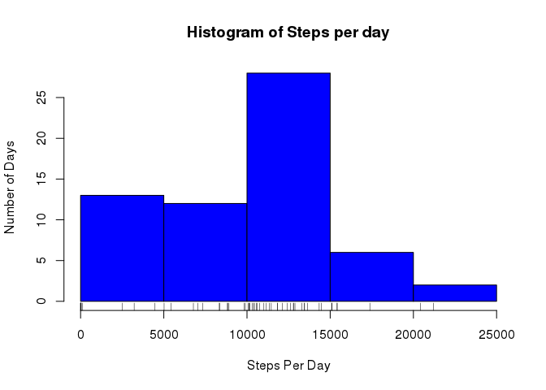
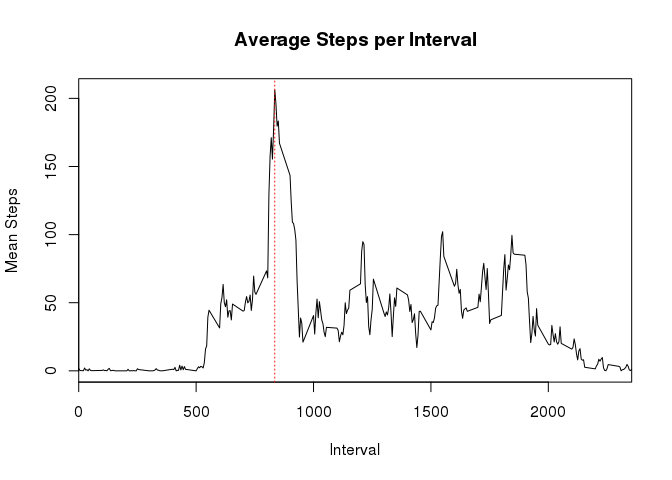
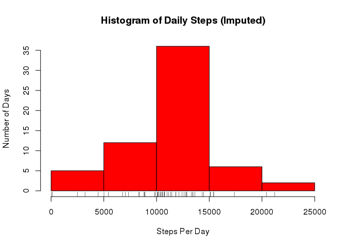
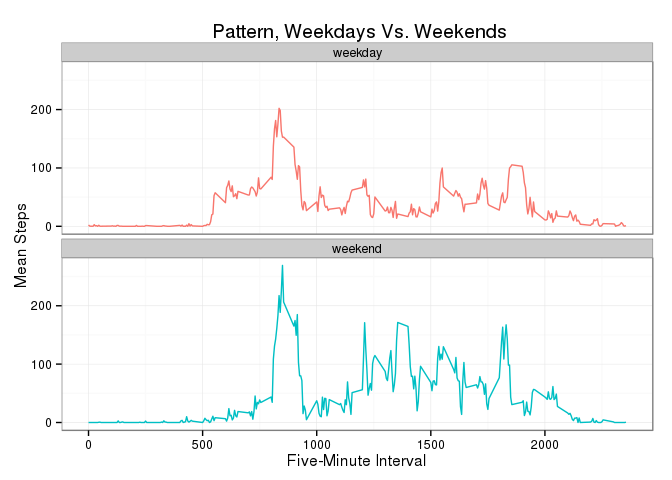
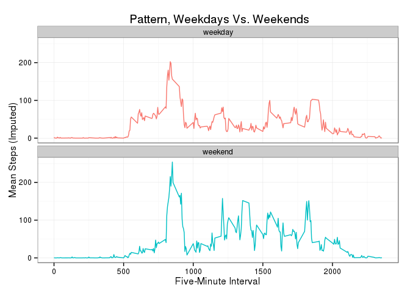
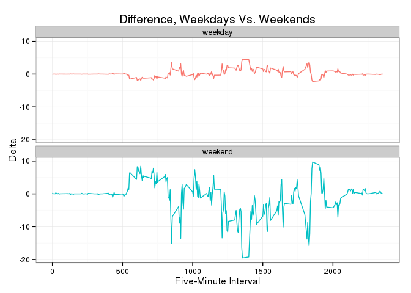
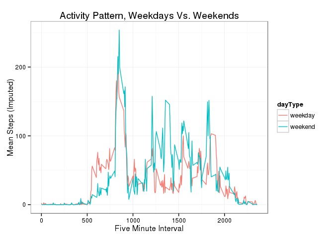
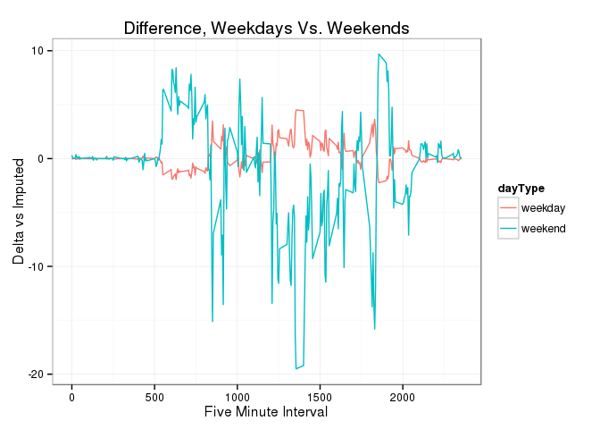

# Reproducible Research - Peer Assessment 1
henfibr  
Wednesday, August 12, 2015  

## Introduction

This assignment makes use of data from a personal activity monitoring
device. This device collects data at 5 minute intervals through out the
day. The data consists of two months of data from an anonymous
individual collected during the months of October and November, 2012
and include the number of steps taken in 5 minute intervals each day.

The data for this assignment can be downloaded from the course web site:

* Dataset: [Activity monitoring data](https://d396qusza40orc.cloudfront.net/repdata%2Fdata%2Factivity.zip) [52K]


The variables included in this dataset are:

* **steps**: Number of steps taking in a 5-minute interval (missing
    values are coded as `NA`)
* **date**: The date on which the measurement was taken in YYYY-MM-DD
    format
* **interval**: Identifier for the 5-minute interval in which
    measurement was taken


The dataset is stored in a comma-separated-value (CSV) file and there are a total of 17,568 observations in this dataset.


This data analysis uses the following libraries:

* lubridate (for dates manipulation)
* plyr (for data manipulation)
* ggplot2 (for graphics)


## Loading and preprocessing the data - no need to unzip, use the unz() function

```r
	if(!file.exists("activity.zip")){
		stop("File activity.zip was not found
			 in the current working directory")
	}
	activity <- read.csv(unz('activity.zip', 'activity.csv'),
								stringsAsFactors=FALSE)
	activity$date <- ymd(activity$date)
```


## Mean total number of steps taken per day

```r
stepsPerDay <- ddply(activity, .(month=month(date), day=day(date)), summarize,
                    dailySteps = sum(steps,na.rm = TRUE)
)

meanStepsPerDay <- mean(stepsPerDay$dailySteps)
medianStepsPerDay <- median(stepsPerDay$dailySteps)
```

* The mean total number of steps taken per day is 9354.2295082.  
* The median total number of steps taken per day is 10395.


```r
hist(stepsPerDay$dailySteps, col = 'blue',
		xlab = 'Steps Per Day',ylab = 'Number of Days ',
		main = 'Histogram of Steps per day')
rug(stepsPerDay$dailySteps)
```

 

## Average daily activity pattern


```r
meanStepsPerInterval <- ddply(activity, .(interval), summarize, 
	meanSteps = mean(steps, na.rm=TRUE))
maxMeanIntervalSteps <- max(meanStepsPerInterval$meanSteps)
maxIntervalMeanSteps <- meanStepsPerInterval$interval[meanStepsPerInterval$meanSteps==maxMeanIntervalSteps]
```


```r
plot(meanStepsPerInterval$interval,meanStepsPerInterval$meanSteps, 
	xlab = 'Interval', ylab = 'Mean Steps', 
	main = 'Average Steps per Interval', 
	type = 'l', 
	xaxs = 'i' )
abline(v = maxIntervalMeanSteps, col = 'red', lty = 3)
```

 

* The maximum average steps is 206.1698113, at interval 835.  

## Handling missing values (Imputation)


```r
rowsWithMissingValues <- sum(is.na(activity))

activityImputed <- merge(activity, meanStepsPerInterval, by = 'interval', all.x = TRUE)

activityImputed$steps <- ifelse(is.na(activityImputed$steps),activityImputed$meanSteps,activityImputed$steps)

stepsPerDayImputed <- ddply(activityImputed, .(month=month(date),day=day(date)), summarize,
                     dailySteps = sum(steps)
)

meanStepsPerDayImputed <- mean(stepsPerDayImputed$dailySteps)
medianStepsPerDayImputed <- median(stepsPerDayImputed$dailySteps)
```


There are 2304 rows with missing values, all for variable **steps**. 
If we impute the missing values by replacing each with the mean steps for their respective intervals, the mean and median are altered as follows:

* mean = 1.0766189\times 10^{4}
* median = 1.0766189\times 10^{4}  


```r
hist(stepsPerDayImputed$dailySteps, col = 'red',
	xlab = 'Steps Per Day',ylab = 'Number of Days',
	main = 'Histogram of Daily Steps (Imputed)')
rug(stepsPerDayImputed$dailySteps)
```

 

## Differences in activity patterns between weekdays and weekends

### A. Missing Values Removed

```r
activity$dayType <- as.factor(ifelse(wday(activity$date) < 6, 'weekday', 'weekend'))

meanStepsPerIntervalPerType <- ddply(activity, .(dayType,interval), summarize, meanSteps = mean(steps, na.rm=TRUE))

plot <- ggplot(meanStepsPerIntervalPerType, 
	aes(x = interval,y = meanSteps))

plot + geom_line(aes(col = dayType)) + facet_wrap(~dayType,ncol=1) + labs(title=" Pattern, Weekdays Vs. Weekends") + xlab('Five-Minute Interval') + ylab('Mean Steps') + theme_bw() + theme(legend.position="none")
```

 

### B. Missing Values Imputed


```r
# imputed ver.
activityImputed$dayType <- as.factor(ifelse(wday(activityImputed$date) < 6, 'weekday', 'weekend'))
meanStepsPerIntervalPerTypeImputed <- ddply(activityImputed, .(dayType,interval), summarize, 
	meanSteps = mean(steps, na.rm=TRUE))

plot <- ggplot(meanStepsPerIntervalPerTypeImputed, 
	aes(x = interval,y = meanSteps))

# facets
plot + geom_line(aes(col = dayType)) + facet_wrap(~dayType,ncol=1) + labs(title=" Pattern, Weekdays Vs. Weekends") + xlab('Five-Minute Interval') + ylab('Mean Steps (Imputed)') + theme_bw() + theme(legend.position="none")
```

 

### Difference Between Non-Imputed and Imputed Results

```r
delta <- meanStepsPerIntervalPerTypeImputed$meanSteps - meanStepsPerIntervalPerType$meanSteps
difference <- cbind(meanStepsPerIntervalPerType,delta)

plot <- ggplot(difference, 
	aes(x = interval,y = delta))

# with facets
plot + geom_line(aes(col = dayType)) + facet_wrap(~dayType,ncol=1) + labs(title="Difference, Weekdays Vs. Weekends") + xlab('Five-Minute Interval') + ylab('Delta') + theme_bw() + theme(legend.position="none")
```

 

### Alternate Views - Weekday Vs. Weekend

```r
# missing values removed
plot <- ggplot(meanStepsPerIntervalPerType,
	aes(x = interval,y = meanSteps))

plot + geom_line(aes(col = dayType)) + labs(title="Activity Pattern, Weekdays Vs. Weekends") + xlab('Five-Minute Interval') + ylab('Mean Steps') + theme_bw()
```

 

```r
# missing values imputed
plot <- ggplot(meanStepsPerIntervalPerTypeImputed, 
	aes(x = interval,y = meanSteps))

plot + geom_line(aes(col = dayType)) + labs(title="Activity Pattern, Weekdays Vs. Weekends") + xlab('Five Minute Interval') + ylab('Mean Steps (Imputed)') + theme_bw()
```

 

```r
# difference - alternative view
plot <- ggplot(difference, 
		aes(x = interval,y = delta))

plot + geom_line(aes(col = dayType)) + labs(title="Difference, Weekdays Vs. Weekends") + xlab('Five Minute Interval') + ylab('Delta vs Imputed') + theme_bw()
```

 

